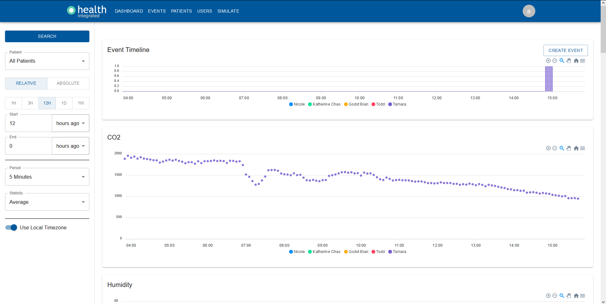

# Integrated Monitoring Health Platform

A platform designed to collect and integrate data from wearables and environmental sensors into a single UI. 

# High Level Architecture

# Deployment Guide

To deploy this solution, please follow our [Deployment Guide](docs/DeploymentGuide.md)

# User Guide

### Main Dashboard

This is the main dashboard where the user will see all patient sensor data that has been recorded, as well as any events that have been input via the dashboard.

On the left sidebar specific timeframes for a search can be specified, as well as a specific patient. The patient dropdown menu allows the user to view the data of all  patients or a specific individual. A relative time interval specifies a timeframe in the format "start: 12 hours ago, end: hours ago". If the time and data is currently 05/31/2022 4:00 pm, the equivalent timeframe using an absolute time interval would be "start: 05/31/2022 4:00am, end: 05/31/2022 4:00pm". The period and statistic dropdown menus allow the user to control the granularity of the data displayed. If use local timezone is disabled, the dashboard will default to using the UTC timezone.

In the Event Timeline, the user will be able to see a timeline of all user inputted events for the specified patients. It is also possible to create events here by clicking the create event button.

Under the Event Timeline is the data of each datatype currently being monitored by the patients. Each datatype will have a separate graph that shows the data for the specified patients. Drag on the graph to zoom in, or use the controls on the top right of the graph to control the zoom.

### Add Events

The events page displays all logged patient events found for the filters on the left. Caregivers are only allowed to see the events of patients who are assigned to them and new events can be logged on this page using the create event button. Events can also be searched by keyword by using the text search field.

### Add Patients, Assign Caregivers and Sensors

The patients page displays all patients along with their assigned patients and sensors. The add patient button at the top right of the dashboard is used to add a patient, a unique patient id is assigned to them at this time. A patient's caregivers and sensors can be managed by clicking the respective manage buttons. The edit patient button allows the user to change the name of a patient.

### Manage Account User Types

This page requires ADMIN permissions to access.

This page manages all of the users who have been registered through the website.

There are 3 types of users: 

- CAREGIVER: Permissions to view the dashboard, patients, and create events are assigned to the caregiver.

- ADMIN: Same as caregiver, with additional permissions to edit caregivers and assign patients.

- UNCLASSIFIED: Upon registration, users are UNCLASSIFIED and do not have any data access permissions until they are assigned another user type.

# License

This project is distributed under the [MIT License](../LICENSE).
